```mermaid
erDiagram

    %% ── ASSET LIFECYCLE ─────────────────────────────────────────────

    VenueAsset {
        Data asset_code PK "immutable, unique"
        Data asset_name
        Select asset_category "Room | Locker"
        Select asset_tier "Locker | Single Standard | Deluxe Single | GH Room | Double Deluxe"
        Select status "Available | Occupied | Dirty | Out of Service"
        Link current_session FK "→ Venue Session (read-only)"
        Check is_active
        Link company FK "→ Company"
        Int expected_stay_duration "minutes"
        Int display_order "board sort"
        Datetime hamilton_last_status_change
        Datetime last_vacated_at
        Datetime last_cleaned_at
        Text reason "required when OOS"
        Int version "optimistic lock counter"
    }

    AssetStatusLog {
        Link venue_asset FK "→ Venue Asset"
        Data old_status
        Data new_status
        Text reason
        Link operator FK "→ User"
        Datetime timestamp
    }

    %% ── SESSION ─────────────────────────────────────────────────────

    VenueSession {
        Data session_number UK "auto: DD-MM-YYYY---NNNN"
        Link venue_asset FK "→ Venue Asset (reqd)"
        Link sales_invoice FK "→ Sales Invoice"
        Link admission_item FK "→ Item"
        Select status "Active | Completed"
        Select assignment_status "Pending | Assigned | Failed"
        Datetime session_start
        Datetime session_end
        Link operator_checkin FK "→ User (reqd)"
        Link operator_vacate FK "→ User"
        Select vacate_method "Key Return | Discovery on Rounds"
        Link shift_record FK "→ Shift Record"
        Link customer FK "→ Customer"
        Data pricing_rule_applied
        Check under_25_applied
        Check comp_flag
        Data identity_method "null at Hamilton"
        Link member_id FK "→ Customer (null at Hamilton)"
        Data full_name "null at Hamilton"
        Date date_of_birth "null at Hamilton"
        Data membership_status "null at Hamilton"
        Data block_status "null at Hamilton"
        Currency arrears_amount "null at Hamilton"
        Check arrears_flag "null at Hamilton"
        Data arrears_sku "null at Hamilton"
        Text scanner_data "null at Hamilton"
        Text eligibility_snapshot "null at Hamilton"
    }

    %% ── CASH CONTROL ────────────────────────────────────────────────

    ShiftRecord {
        Link operator FK "→ User (reqd)"
        Date shift_date
        Select status "Open | Closed"
        Datetime shift_start
        Datetime shift_end
        Currency float_expected
        Currency float_actual
        Currency float_variance "read-only"
        Currency closing_float_actual
        Currency closing_float_variance "read-only"
        Check board_confirmed
        Table board_corrections "→ Hamilton Board Correction"
        Link pos_profile FK "→ POS Profile"
        Link pos_opening_entry FK "→ POS Opening Entry"
        Link pos_closing_entry FK "→ POS Closing Entry"
        Currency operator_declared_card_total
        Currency system_expected_card_total "permlevel 1 — hidden from Operator"
        Select reconciliation_status "Pending | Partially Reconciled | Fully Reconciled"
    }

    CashDrop {
        Link operator FK "→ User (reqd)"
        Link shift_record FK "→ Shift Record"
        Date shift_date
        Data shift_identifier "e.g. Evening"
        Select drop_type "Mid-Shift | End-of-Shift"
        Int drop_number "sequential within shift"
        Datetime timestamp
        Currency declared_amount "operator blind count"
        Check reconciled "read-only"
        Link reconciliation FK "→ Cash Reconciliation (read-only)"
        Link pos_closing_entry FK "→ POS Closing Entry"
    }

    CashReconciliation {
        Link cash_drop FK "→ Cash Drop (reqd)"
        Link shift_record FK "→ Shift Record"
        Link manager FK "→ User (reqd)"
        Datetime timestamp
        Currency actual_count "manager blind count"
        Currency system_expected "read-only; revealed post-submit"
        Currency operator_declared "read-only; copied from drop"
        Currency variance_amount "read-only"
        Select variance_flag "Clean | Possible Theft or Error | Operator Mis-declared"
        Text notes
        Link resolved_by FK "→ User"
        Select resolution_status "Open | Resolved | Dismissed | Escalated"
    }

    HamiltonBoardCorrection {
        Link venue_asset FK "→ Venue Asset"
        Data old_status
        Data new_status
        Text reason
        Link operator FK "→ User"
        Datetime timestamp
    }

    %% ── COMP / AUDIT ─────────────────────────────────────────────────

    CompAdmissionLog {
        Link venue_session FK "→ Venue Session (reqd)"
        Link sales_invoice FK "→ Sales Invoice"
        Link admission_item FK "→ Item"
        Currency comp_value "permlevel 1 — hidden from Operator"
        Link operator FK "→ User (reqd)"
        Datetime timestamp
        Select reason_category "Loyalty Card | Promo | Manager Decision | Other"
        Text reason_note "required when category = Other"
    }

    HamiltonSettings {
        Currency float_amount "default 300"
        Int default_stay_duration_minutes "default 360"
        Data printer_ip_address
        Data printer_model
        Data printer_label_template_name
        Int grace_minutes "default 15"
        Int assignment_timeout_minutes "default 15"
        Check show_waitlist_tab
        Check show_other_tab
    }

    %% ── RELATIONSHIPS ────────────────────────────────────────────────

    VenueAsset       ||--o{ VenueSession         : "hosts (current_session)"
    VenueAsset       ||--o{ AssetStatusLog        : "logged in"
    VenueAsset       ||--o{ HamiltonBoardCorrection : "corrected in"

    VenueSession     }o--||  VenueAsset           : "assigned to"
    VenueSession     }o--o|  ShiftRecord           : "opened during"
    VenueSession     }o--o|  SalesInvoice          : "billed via"
    VenueSession     ||--o{  CompAdmissionLog      : "comped via"

    ShiftRecord      ||--o{  CashDrop              : "receives"
    ShiftRecord      ||--o{  HamiltonBoardCorrection : "contains"

    CashDrop         ||--o|  CashReconciliation    : "reconciled by"

    CompAdmissionLog }o--o|  SalesInvoice          : "invoiced as"
```

# Hamilton ERP — Data Model Reference

## TL;DR

Hamilton ERP extends Frappe/ERPNext with 9 custom DocTypes organized around four concerns: the physical asset lifecycle (rooms and lockers moving through Available → Occupied → Dirty → Available), the guest session that drives that lifecycle, the cash control system (blind drops + manager reconciliation), and the comp/audit layer. All 9 DocTypes live in one ERPNext company ("Club Hamilton") and reference a shared Walk-in Customer and CAD Currency. Venue Session is the hub — it links to Venue Asset, Shift Record, Sales Invoice, and Customer simultaneously, making it the record that ties a physical space, a payment, a shift, and a guest into a single audit trail.

---

---

## DocType Reference

### Venue Asset

| Field | Type | Required | Key | Notes |
|---|---|---|---|---|
| `asset_code` | Data | Yes | Unique; `reqd:1` | Immutable after creation (e.g. R001, L001). Never changes even if display name is renamed. |
| `asset_name` | Data | Yes | | Display name on POS and board. Changeable. |
| `asset_category` | Select | Yes | `search_index` | Room or Locker. |
| `asset_tier` | Select | Yes | `search_index` | Locker / Single Standard / Deluxe Single / GH Room / Double Deluxe. |
| `status` | Select | Yes | `search_index` | Available / Occupied / Dirty / Out of Service. Default: Available. |
| `current_session` | Link → Venue Session | No | FK | Read-only. Cleared when session completes. |
| `is_active` | Check | No | | Soft-disable without deleting. Default: 1. |
| `company` | Link → Company | No | FK | ERPNext multi-company support. |
| `expected_stay_duration` | Int | No | | Minutes. Default: 360. Drives overtime indicator on board. |
| `display_order` | Int | No | `search_index` | Board tile sort. Lower = earlier. |
| `hamilton_last_status_change` | Datetime | No | | Auto-set on every status transition. Read-only. |
| `last_vacated_at` | Datetime | No | | Set on Occupied → Dirty. |
| `last_cleaned_at` | Datetime | No | | Set on Dirty → Available. |
| `reason` | Text | Conditional | | Mandatory when `status = Out of Service`. |
| `version` | Int | No | Optimistic lock | Incremented on every status change. Hidden. |

Naming series: `VA-.####`. Permissions: Operator (create/write/read), Manager (read + reporting), Admin (full).

---

### Venue Session

| Field | Type | Required | Key | Notes |
|---|---|---|---|---|
| `session_number` | Data | No (auto) | Unique; `search_index` | Format: `DD-MM-YYYY---NNNN`. Unique constraint is the retry-loop contract in `lifecycle._create_session` — must not be dropped. |
| `venue_asset` | Link → Venue Asset | Yes | FK; `search_index` | The room or locker this session occupies. |
| `sales_invoice` | Link → Sales Invoice | No | FK | Populated after payment is captured. |
| `admission_item` | Link → Item | No | FK | ERPNext Item used as the admission SKU. |
| `status` | Select | Yes | `search_index` | Active / Completed. Default: Active. |
| `assignment_status` | Select | No | | Pending / Assigned / Failed. Tracks post-payment asset-assignment outcome (DEC-020). |
| `session_start` | Datetime | Yes | | Check-in time. |
| `session_end` | Datetime | No | | Populated on vacate. |
| `operator_checkin` | Link → User | Yes | FK | Read-only. Set at creation. |
| `operator_vacate` | Link → User | No | FK | Set when session ends. |
| `vacate_method` | Select | No | | Key Return or Discovery on Rounds. |
| `shift_record` | Link → Shift Record | No | FK | Read-only. Links session to the active shift. |
| `customer` | Link → Customer | No | FK | Default: "Walk-in". |
| `pricing_rule_applied` | Data | No | | Audit trail. Read-only. |
| `under_25_applied` | Check | No | | Audit trail. Read-only. |
| `comp_flag` | Check | No | | True if this session was comped. Read-only. |
| `identity_method` | Data | No | | **Forward-compat (Philadelphia).** Default: `not_applicable` at Hamilton. |
| `member_id` | Link → Customer | No | FK | **Forward-compat.** Null at Hamilton. |
| `full_name` | Data | No | | **Forward-compat.** Null at Hamilton. |
| `date_of_birth` | Date | No | | **Forward-compat.** Null at Hamilton. |
| `membership_status` | Data | No | | **Forward-compat.** Null at Hamilton. |
| `block_status` | Data | No | | **Forward-compat.** Null at Hamilton. |
| `arrears_amount` | Currency | No | | **Forward-compat.** Null at Hamilton. |
| `arrears_flag` | Check | No | | **Forward-compat.** Null at Hamilton. |
| `arrears_sku` | Data | No | | **Forward-compat.** Null at Hamilton. |
| `scanner_data` | Text | No | | **Forward-compat.** Null at Hamilton. |
| `eligibility_snapshot` | Text | No | | **Forward-compat.** Null at Hamilton. |

Naming: random hash UUID. `track_changes: 1`.

---

### Asset Status Log

| Field | Type | Required | Key | Notes |
|---|---|---|---|---|
| `venue_asset` | Link → Venue Asset | No | FK | The asset whose status changed. |
| `old_status` | Data | No | | Previous status string. |
| `new_status` | Data | No | | New status string. |
| `reason` | Text | No | | Operator-supplied reason. Populated for OOS transitions. |
| `operator` | Link → User | No | FK | Who made the change. |
| `timestamp` | Datetime | No | | When the change occurred. |

`istable: 1` — this is a **child table** used as an embedded log, not a standalone DocType with a list view. `track_changes: 0` — deliberate anti-recursion design (logging the log would recurse infinitely).

---

### Shift Record

| Field | Type | Required | Key | Notes |
|---|---|---|---|---|
| `operator` | Link → User | Yes | FK; `search_index` | Who worked the shift. |
| `shift_date` | Date | Yes | | Calendar date of the shift. |
| `status` | Select | Yes | `search_index` | Open / Closed. Default: Open. |
| `shift_start` | Datetime | Yes | | |
| `shift_end` | Datetime | No | | Populated on close. |
| `float_expected` | Currency | Yes | | Configured float amount at shift start. |
| `float_actual` | Currency | No | | Operator-counted float at shift start. |
| `float_variance` | Currency | No | Read-only | `float_actual - float_expected`. |
| `closing_float_actual` | Currency | No | | Counted by operator at shift end. |
| `closing_float_variance` | Currency | No | Read-only | `closing_float_actual - float_expected`. |
| `board_confirmed` | Check | No | | Operator confirmed board matches physical reality at shift start. |
| `board_corrections` | Table → Hamilton Board Correction | No | Child table | Structured corrections recorded at shift start. |
| `pos_profile` | Link → POS Profile | No | FK | |
| `pos_opening_entry` | Link → POS Opening Entry | No | FK | |
| `pos_closing_entry` | Link → POS Closing Entry | No | FK | |
| `operator_declared_card_total` | Currency | No | | Operator reads terminal batch and enters. |
| `system_expected_card_total` | Currency | No | `permlevel:1` | Calculated from card Sales Invoices. Hidden from Operator role. Blind-count theft detection (DEC-038). |
| `reconciliation_status` | Select | No | | Pending / Partially Reconciled / Fully Reconciled. Auto-updated. |

Naming series: `SR-.YYYY.MM.-.####`.

---

### Cash Drop

| Field | Type | Required | Key | Notes |
|---|---|---|---|---|
| `operator` | Link → User | Yes | FK | Who made the drop. |
| `shift_record` | Link → Shift Record | No | FK; `search_index` | Which shift the drop belongs to. |
| `shift_date` | Date | Yes | | |
| `shift_identifier` | Data | Yes | | Human label, e.g. "Evening". |
| `drop_type` | Select | Yes | | Mid-Shift or End-of-Shift. |
| `drop_number` | Int | Yes | | Sequential within the shift (Drop 1, Drop 2…). |
| `timestamp` | Datetime | Yes | | When the drop occurred. |
| `declared_amount` | Currency | Yes | | Operator's stated amount — entered blind, never shown alongside system totals. |
| `reconciled` | Check | No | Read-only | Flipped when a Cash Reconciliation is submitted against this drop. |
| `reconciliation` | Link → Cash Reconciliation | No | FK; read-only | Populated when reconciled. |
| `pos_closing_entry` | Link → POS Closing Entry | No | FK; read-only | Background ERPNext accounting entry. |

Naming series: `DROP-.YYYY.MM.-.####`.

---

### Cash Reconciliation

| Field | Type | Required | Key | Notes |
|---|---|---|---|---|
| `cash_drop` | Link → Cash Drop | Yes | FK | The drop being reconciled. |
| `shift_record` | Link → Shift Record | No | FK | Denormalized shortcut for reporting (DEC-042). Reachable via `cash_drop` but stored directly. |
| `manager` | Link → User | Yes | FK | Who performed the count. |
| `timestamp` | Datetime | Yes | | When the reconciliation was performed. |
| `actual_count` | Currency | Yes | | Manager's physical count — entered blind before any expected figures are shown. |
| `system_expected` | Currency | No | Read-only | Calculated from POS transactions. Revealed only after manager submits. Never visible to Operator role (DEC-021). |
| `operator_declared` | Currency | No | Read-only | Copied from Cash Drop. Revealed post-submit. |
| `variance_amount` | Currency | No | Read-only | `actual_count - system_expected`. Negative = short. |
| `variance_flag` | Select | No | Read-only | Clean / Possible Theft or Error / Operator Mis-declared. |
| `notes` | Text | No | | Manager annotation. |
| `resolved_by` | Link → User | No | FK | Null until investigated. |
| `resolution_status` | Select | No | | Open / Resolved / Dismissed / Escalated. |

`is_submittable: 1` — submission locks the record and triggers the blind-reveal sequence. Naming series: `RECON-.YYYY.MM.-.####`.

---

### Comp Admission Log

| Field | Type | Required | Key | Notes |
|---|---|---|---|---|
| `venue_session` | Link → Venue Session | Yes | FK | The session this comp covers. |
| `sales_invoice` | Link → Sales Invoice | No | FK | The $0 or discounted invoice. |
| `admission_item` | Link → Item | No | FK | The SKU that was comped. |
| `comp_value` | Currency | No | `permlevel:1` | What the comp was worth. Hidden from Operator role (margin-leak protection). Auto-populated by Phase 2 flow. |
| `operator` | Link → User | Yes | FK | Who issued the comp. |
| `timestamp` | Datetime | Yes | | |
| `reason_category` | Select | Yes | | Loyalty Card / Promo / Manager Decision / Other. |
| `reason_note` | Text | Conditional | | Mandatory when `reason_category = Other`. Max 500 chars (DEC-016). |

Naming series: `CAL-.YYYY.MM.-.####`.

---

### Hamilton Settings (Singleton)

| Field | Type | Notes |
|---|---|---|
| `float_amount` | Currency | Default $300. Per-venue when multi-venue ships. |
| `default_stay_duration_minutes` | Int | Default 360. |
| `printer_ip_address` | Data | Brother QL-820NWB. |
| `printer_model` | Data | |
| `printer_label_template_name` | Data | |
| `grace_minutes` | Int | Default 15. Overtime overlay trigger on board. |
| `assignment_timeout_minutes` | Int | Default 15. Flags paid-but-unassigned sessions. |
| `show_waitlist_tab` | Check | Phase 2 placeholder. Default: off. |
| `show_other_tab` | Check | Venue-specific tab. Default: off. |

`issingle: 1` — one row for the entire site. There is no `anvil_venue_id` field in the current JSON; venue differentiation is handled via `frappe.conf` at the bench level, not inside this DocType.

---

### Hamilton Board Correction (Child Table)

| Field | Type | Notes |
|---|---|---|
| `venue_asset` | Link → Venue Asset | Which asset was corrected. |
| `old_status` | Data | Status before correction. |
| `new_status` | Data | Status after correction. |
| `reason` | Text | Why the correction was made. |
| `operator` | Link → User | Who made it. |
| `timestamp` | Datetime | When it was recorded. |

`istable: 1` — embedded inside Shift Record's `board_corrections` table field. Not accessible as a standalone list. `track_changes: 1`.

---

## Relationships Narrative

### Venue Session → Venue Asset (bidirectional pointer)

The most important relationship in the schema is intentionally bidirectional. When a session is created, `VenueSession.venue_asset` points to the asset. Simultaneously, `VenueAsset.current_session` is set to that session's name. This two-pointer design means either side can be the starting point for a lookup without a JOIN: the board reads `current_session` directly off the asset tile; the session detail page reads `venue_asset` to show which room. The `current_session` field is read-only and auto-managed by the lifecycle code — operators cannot set it manually. When the session completes, `current_session` is cleared and the asset status moves to Dirty.

### Cash Drop → Shift Record

A shift accumulates multiple cash drops. Each drop carries a `shift_record` FK and a sequential `drop_number` so the history of "Drop 1 at 9pm, Drop 2 at 11pm, End-of-Shift at 2am" can be reconstructed in order. The `declared_amount` on each drop is what the operator stated, entered blind — the operator never sees what the POS system expects before declaring. This is the core theft-detection design (DEC-021).

### Cash Reconciliation → Cash Drop (and the denormalized Shift Record link)

Each Cash Drop gets exactly one Cash Reconciliation record when the manager performs a count. The reconciliation carries both `cash_drop` (the primary FK) and a direct `shift_record` link. The `shift_record` duplication is intentional (DEC-042): it allows a single query to pull all reconciliations for a shift without traversing through the drop table. After reconciliation is submitted, the drop's `reconciled` flag is flipped and `reconciliation` FK is populated, making the link navigable from either direction.

### Comp Admission Log → Sales Invoice + Venue Session

A comp is always anchored to a session (`venue_session`, required). It optionally links to a `sales_invoice` — the $0 or discounted invoice that records the transaction in ERPNext's accounting ledger — and to the `admission_item` SKU that was comped. The `comp_value` field records the monetary cost of the comp but is hidden from the Operator role at the API layer (`permlevel:1`). This prevents operators from seeing the cost of their own comps and self-justifying margin leakage. When a session is comped, `VenueSession.comp_flag` is also set to true, making it easy to filter comped sessions on the board or in reports without joining to this table.

### Shift Record → Hamilton Board Correction (embedded child table)

At shift start, the operator confirms the board matches physical reality and records any discrepancies in the `board_corrections` child table. Each correction row is a `Hamilton Board Correction` record embedded inside the shift — not a separate top-level DocType. This keeps shift-start corrections atomically attached to the shift and prevents them from being edited after the shift record is closed.

---

## Multi-Venue Boundaries

### Per-venue (isolated at Hamilton today, will diverge at Philadelphia/DC)

| Artifact | Notes |
|---|---|
| **Hamilton Settings** | Singleton per Frappe site. A second venue needs a second Frappe site (or this DocType gains a `venue` FK in Phase 2). Currently holds `float_amount`, printer config, and grace thresholds — all Hamilton-specific. |
| **POS Profile** | Each venue needs its own. Linked via `ShiftRecord.pos_profile`. |
| **Sales Taxes Template** | Per place-of-supply jurisdiction. Hamilton uses "Ontario HST 13%". Philadelphia needs PA state sales tax; DC needs its own. Never share across venues. |
| **Venue Assets** | All 59 assets (`VA-0001` … `VA-0059`) belong to Hamilton. Philadelphia assets will need their own codes and a venue discriminator if running on the same site. |

### Global / shared across venues on the same ERPNext site

| Artifact | Notes |
|---|---|
| **Customer "Walk-in"** | A single ERPNext Customer record shared by every anonymous session at Hamilton. If Philadelphia runs on the same site, it will default to the same Walk-in Customer unless a second walk-in customer per venue is created. |
| **Currency CAD** | Site-global. Carries `smallest_currency_fraction_value = 0.05` (nickel rounding). Any non-cash invoice on this site will round to the nearest nickel unless `disable_rounded_total = 1` is set per invoice. |
| **ERPNext Item catalog** | Admission SKUs (the 4 Hamilton items) are shared on the item master. Philadelphia will add its own SKUs to the same master. |

---

## Forward-Compat Fields — Philadelphia / DC

Venue Session carries 10 fields that are null at Hamilton but designed for Philadelphia's age-verification and membership-check flow. These are documented here so they don't look like dead code.

| Field | Type | Hamilton value | Populates at |
|---|---|---|---|
| `identity_method` | Data | `"not_applicable"` | Philadelphia — records how age was verified (ID scan, membership card, etc.) |
| `member_id` | Link → Customer | `null` | DC — links to a registered member record |
| `full_name` | Data | `null` | Philadelphia — name captured from ID scan |
| `date_of_birth` | Date | `null` | Philadelphia — triggers under-25 pricing check |
| `membership_status` | Data | `null` | DC — current membership tier from the membership system |
| `block_status` | Data | `null` | DC — whether the member is blocked from entry |
| `arrears_amount` | Currency | `null` | DC — outstanding balance owed |
| `arrears_flag` | Check | `0` | DC — true when `arrears_amount > 0` |
| `arrears_sku` | Data | `null` | DC — which SKU the arrears are for |
| `scanner_data` | Text | `null` | Philadelphia — raw barcode/NFC payload from the door scanner |
| `eligibility_snapshot` | Text | `null` | Philadelphia/DC — JSON blob capturing eligibility check result at check-in time |

These fields are part of risk R-007 (PII at rest). When Philadelphia rolls out and these fields begin receiving real data, the privacy risk assessment must be re-run. See `docs/risk_register.md`.
